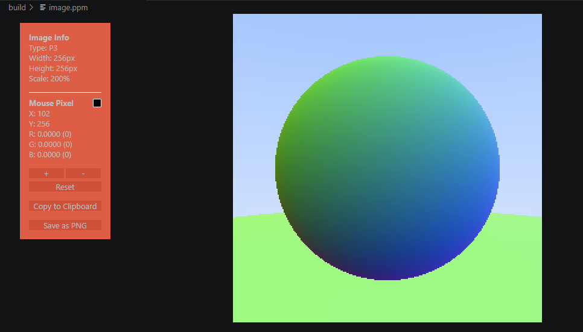

# C++ Basic Raytracer

A high-performance, object-oriented ray tracer built from scratch in modern C++. 

This project demonstrates the core mathematical and architectural foundations of 3D rendering, including ray-sphere intersection logic, surface normal calculations, and memory-safe polymorphic object management. 



## 🛠️ Architecture
- **Modern C++ (C++17):** Strict adherence to RAII, `std::shared_ptr` for automated reference counting, and `const`-correctness.
- **CMake Build System:** Configured for cross-platform compilation and out-of-source builds.
- **Object-Oriented Design:** Uses the Interface-Implementation pattern (`hittable` base class) to allow dynamic, polymorphic resolution of geometric intersections at runtime.
- **Mathematical Modeling:** Custom high-performance `vec3` class heavily utilizing `inline` operator overloading to eliminate function call overhead during the millions of required vector operations.

## 🚀 How to Build and Run

1. Clone the repository:
   ```bash
   git clone https://github.com/kaushikGA/Basic-Raytracer.git
   cd Basic-Raytracer
2. Build the repository:
   ```bash
   cmake -B build
3. Compile the project:
   ```bash
   cmake --build build
4. Execute the binary:
   ```bash
   ./build/raytracer.exe
   
## 📚 Attribution

This architecture was inspired by and built following the mathematical principles outlined in Peter Shirley's excellent series, Ray Tracing in One Weekend. Modifications were made to adapt the camera viewport coordinate system and output formatting.
https://raytracing.github.io/
